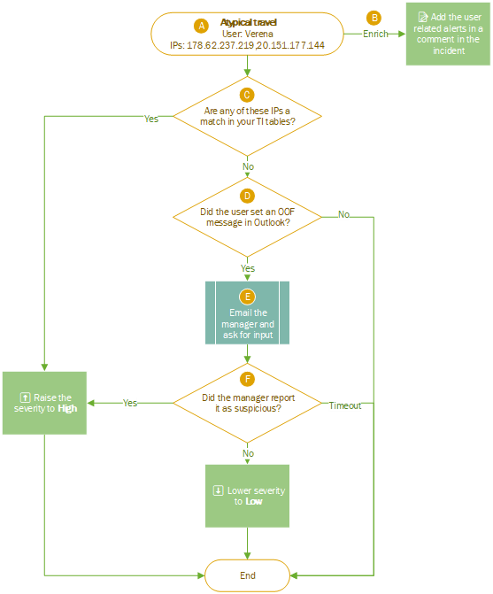

# Sample Playbooks

Here are examples of automation using STATS. These examples are provided to illustrate how you can easily articulate an automated response using multiple STATS modules. They do not constitute a list of recommended automations. 

## Atypical travel alert triage
The alert [Atypical travel](https://docs.microsoft.com/en-us/azure/active-directory/identity-protection/concept-identity-protection-risks) is provided by Azure AD Identity Protection. Its severity is medium.

Here is an example of what a triage assistance could look like:

**A**  The alert Atypical travel is triggers for the user Verena. Two IPs comes along with the alert. The first IP listed here is atypical source and the second is the previous IP for that user. 

**B**  Use the `Related Alerts module` to enrich the incident and add the list of all the active alerts for this user into an incident comment.  

**C**  Use the `Threat Intelligence module` to check if any of these IP addresses have a match in our Threat Intelligence table. If yes, we raise the severity of the incident to **High**. If not, we continue with the automation.  

**D**  Use the `Out of Office module` to check if the user has set an out of office message on its mailbox. If no messages are set, then we stop the automation, else we continue.

**E**  We send an approval email to the user's manager. The manager will have one hour to provide input on the atypical location for the user.

**F** If the manager doesn't answer within an hour, the automation stops. If the manager confirm the connection is suspicious we raise the severity of the incident to **High**. If the manager confirm that the location is legitimate (based on the personal knowledge) we lower the severity of the incident to **Low**. 

## Unfamiliar sign-in properties triage
The alert [Unfamiliar sign-in properties](https://docs.microsoft.com/en-us/azure/active-directory/identity-protection/concept-identity-protection-risks) is provided by Azure AD Identity Protection. Its severity can vary.

Here is an example of what a triage assistance could look like:

**A**  The alert Unfamiliar sign-in properties is triggered for the user Verena. The IP of the unfamiliar connection comes along with the alert as well as the session ID (which is the Request ID in the Azure AD Sign in logs) and the user-agent-string of the client.  

**B**  Use the `KQL module` to enrich the incident and add the list of known IPs and user-agent-strings for the user.

**C**  Use the `Watchlist module` to enrich the incident and add a **VIP tag**.

**D**  Use the `MCAS module` to and check if the investigation score of the user is higher than 100. If so, raise the severity of the incident to **High**.

**E**  Use the `AzureAD User Risk module` to and check if there are known suspicious MFA requests (more than 2 MFA requests which timed-out) or report MFA frauds. If so, raise the severity to **High**. 

**F**  Else we lower the sevirity to **Low**.